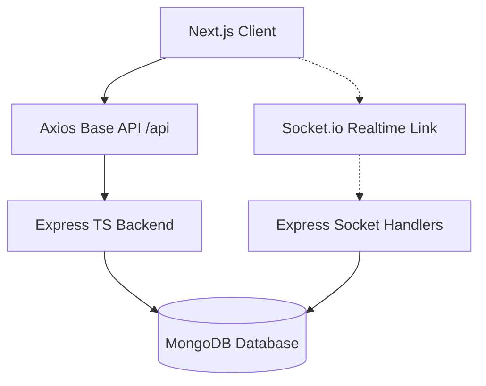

# DevSync: Real-Time Collaborative Code Editor

DevSync is a Real-Time Collaborative Code Editor Space designed for speed, pair programming, and an extremely premium futuristic terminal visual experience.

## ✨ Features
- **Real-Time Collaboration**: Sub-millisecond synchronization powered by Socket.io web sockets.
- **Rich Editor Capabilities**: Deep integration with `@monaco-editor/react` containing full syntax highlighting structure.
- **Multiple Languages Support**: Run and collaborate in JavaScript, TypeScript, Python, Java, C++, Go, Rust, and PHP.
- **Futuristic Aesthetics**: Fully integrated glass-morphism panels, dark deep-space backgrounds, floating particle grids, and buttery 60fps Framer Motion effects.
- **Production API Foundation**: Express.js server holding a NoSQL DB instance (MongoDB) with Encrypted JSON Web Tokens (JWT) maintaining secure room sessions.

## 🧱 Architecture Diagram

- **Monaco Editor Component**: Uses `deltaDecorations` to map other participant carets and visual cues directly back from WebSocket state.
- **Operational Debouncing**: Ensures fast memory reads while saving states directly to MongoDB in throttled chunks asynchronously.

## 🚀 Setup Instructions

### Prerequisites
Make sure to have [Node.js (LTS)](https://nodejs.org) and an active [MongoDB Server](https://www.mongodb.com/) running locally on port 27017.

### Installation

1. **Install Server Packages**
   ```bash
   cd server
   npm install
   ```

2. **Install Client Packages**
   ```bash
   cd client
   npm install
   ```

### Running Locally

To launch DevSync, boot both sides in parallel:

**Backend:**
```bash
cd server
npm run dev
# Running on http://localhost:5000
```

**Frontend:**
```bash
cd client
npm run dev
# Running on http://localhost:3000
```
Then navigate to `http://localhost:3000` via your web browser to immerse yourself in DevSync.
